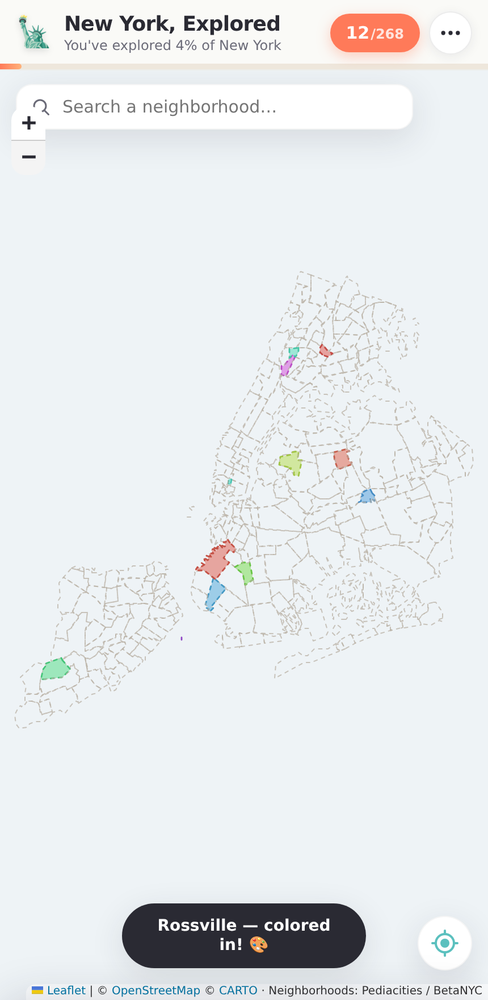

# New York, Explored 🗽

A little travel-map for New York City. Like those scratch-off maps of the world
where you fill in each country you've visited — but for the **189 neighborhoods
across all five boroughs** of NYC.

Tap a neighborhood and it colors in with its own unique pastel. Keep notes and
attach photos so you remember each place. Watch how much of the city you've seen
fill up over the course of your trip.



## Features

- 🗺️ **Interactive map** of all five boroughs — zoom and pan across **268
  neighborhoods** using the widely-recognized Pediacities / BetaNYC boundaries
  (SoHo, NoHo, Nolita, DUMBO, a single Williamsburg, and so on).
- 🏷️ **Named neighborhoods** — labels appear right on the map as you zoom in, so
  you can see where you are without tapping anything.
- 👆 **Dismiss the card** by tapping elsewhere on the map, swiping it down, or
  hitting the × — whichever's handiest.
- 🎨 **Tap to color in** — each neighborhood gets its own distinct, evenly-spread
  pastel color when you mark it visited.
- ⚙️ **Choose your tap behavior** (Settings) — either *tap to preview* (opens the
  card; you color it in with the Visited button, nothing marked by accident) or
  *tap to color in* (instant, fastest for checking off lots of places).
- 📝 **Notes** per neighborhood — jot what you did, what you liked, what to come
  back for. Saved automatically.
- 📷 **Photos** per neighborhood — attach pictures to remember the place. Images
  are resized on device before being stored.
- 📊 **Progress tracking** — an overall percentage plus a per-borough breakdown so
  you can see, e.g., that you've done 40% of Manhattan but only 5% of Queens.
- 🔍 **Search** any neighborhood by name and fly straight to it.
- 📍 **"Where am I?"** — uses your device location to find the neighborhood
  you're standing in and offer to color it in.
- 💾 **Export / import** your data as a JSON backup.
- 🌤️ Light, friendly, mobile-first design.

## Privacy

Everything lives **only on your device** — visited neighborhoods and notes in
`localStorage`, photos in the browser's `IndexedDB`. Nothing is uploaded to any
server. The only network requests are for the light basemap tiles (CARTO /
OpenStreetMap).

Because your data is device-local, use **☰ → Export my data** now and then to
keep a backup — especially before clearing your browser or switching phones.

## Running it

It's a static site — no build step, no dependencies to install.

```bash
# from the project folder
python3 -m http.server 8000
# then open http://localhost:8000
```

Or use any static file server. To use it on your phone while you're out in the
city, host the folder anywhere static (GitHub Pages, Netlify, Vercel, etc.) and
open the URL on your phone. "Add to Home Screen" makes it feel like an app.

> Note: geolocation ("Where am I?") requires a secure context, so it works on
> `localhost` and over `https://`, but not over plain `http://` on a remote host.

## How it's built

Plain HTML/CSS/JavaScript with [Leaflet](https://leafletjs.com/) for the map —
no framework, no bundler. Leaflet is vendored locally (`vendor/leaflet/`) so the
app shell keeps working even on a flaky connection; only the map tiles need the
network.

```
index.html                    markup + layout
assets/style.css              styles
assets/app.js                 map, interaction, state, search, locate, stats
assets/db.js                  IndexedDB wrapper for photos
data/neighborhoods.geojson    268 neighborhoods, 5 boroughs
vendor/leaflet/               bundled Leaflet library
```

### Data

Neighborhood boundaries come from the **Pediacities NYC Neighborhoods** dataset
(via BetaNYC / the HodgesWardElliott refinements) — the widely-adopted set of
colloquial neighborhood names and boundaries (SoHo, NoHo, Nolita, DUMBO, a single
Williamsburg, etc.), rather than the Census "tabulation areas" that split and
rename familiar neighborhoods. Multi-part areas are merged so each neighborhood
is one entry, giving 268 neighborhoods across the five boroughs.

## Ideas for later

- Filter the map to "visited only" or by borough
- A shareable end-of-trip summary card
- Date-stamped visit history / a timeline
- PWA offline caching of tiles for the areas you're in
